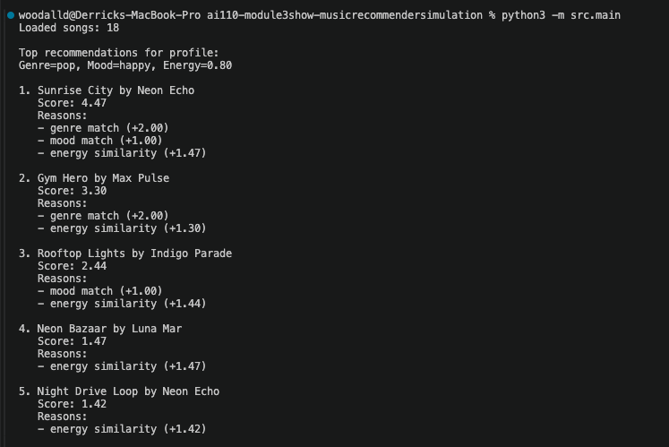

# 🎵 Music Recommender Simulation

## Project Summary

In this project you will build and explain a small music recommender system.

Your goal is to:

- Represent songs and a user "taste profile" as data
- Design a scoring rule that turns that data into recommendations
- Evaluate what your system gets right and wrong
- Reflect on how this mirrors real world AI recommenders

Replace this paragraph with your own summary of what your version does.

---

## How The System Works

This music recommender uses a **content-based filtering** approach. Instead of learning from many users, it compares each song's features to one user's taste profile and gives that song a score. The songs with the highest scores become the recommendations.

Each song in `songs.csv` stores descriptive features that capture its overall vibe: `genre`, `mood`, `energy`, `tempo_bpm`, `valence`, `danceability`, and `acousticness`. The `UserProfile` stores matching target preferences, such as a favorite genre, favorite mood, and ideal values for those numeric features. For example, a user who likes focused lofi music might prefer lower energy, slower tempo, and higher acousticness.

### Algorithm Recipe

For every song in the CSV:

1. Start the song's score at `0`.
2. Add **2.0 points** if the song's genre matches the user's favorite genre.
3. Add **1.0 point** if the song's mood matches the user's favorite mood.
4. Add similarity points based on how close the song is to the user's target values:
   - `energy`: up to **1.5** points
   - `tempo_bpm`: up to **1.0** point
   - `valence`: up to **1.0** point
   - `danceability`: up to **0.75** point
   - `acousticness`: up to **0.75** point
5. Save the final score for that song.
6. Repeat for every song in the dataset.
7. Rank all songs from highest score to lowest score.
8. Recommend the top results.

This design makes the scoring easy to explain: exact category matches matter, but songs can still earn points when their audio features are close to the user's ideal profile.

### Potential Biases

This system might **over-prioritize genre**, which could cause it to ignore songs from other genres that still match the user's mood or audio preferences well. It is also limited by the small dataset, so genres or moods with fewer examples may be recommended less often even if they would fit the user's taste.

---

## Getting Started

### Setup

1. Create a virtual environment (optional but recommended):

   ```bash
   python -m venv .venv
   source .venv/bin/activate      # Mac or Linux
   .venv\Scripts\activate         # Windows

2. Install dependencies

```bash
pip install -r requirements.txt
```

3. Run the app:

```bash
python -m src.main
```

### Running Tests

Run the starter tests with:

```bash
pytest
```

You can add more tests in `tests/test_recommender.py`.

---

## Experiments You Tried

Use this section to document the experiments you ran. For example:

- What happened when you changed the weight on genre from 2.0 to 0.5
- What happened when you added tempo or valence to the score
- How did your system behave for different types of users

## CLI Verification

I ran the command below to verify the recommender output in the terminal:

```bash
python -m src.main
```

For the default profile (`genre=pop`, `mood=happy`, `energy=0.8`), the top results matched expectations. Songs like `Sunrise City` ranked at the top because they matched both the preferred genre and mood and were also close on energy.

Add your terminal screenshot here after running the program:



---

## Limitations and Risks

Summarize some limitations of your recommender.

Examples:

- It only works on a tiny catalog
- It does not understand lyrics or language
- It might over favor one genre or mood

You will go deeper on this in your model card.

---

## Reflection

Read and complete `model_card.md`:

[**Model Card**](model_card.md)

Write 1 to 2 paragraphs here about what you learned:

- about how recommenders turn data into predictions
- about where bias or unfairness could show up in systems like this


---

## 7. `model_card_template.md`

Combines reflection and model card framing from the Module 3 guidance. :contentReference[oaicite:2]{index=2}  

```markdown
# 🎧 Model Card - Music Recommender Simulation

## 1. Model Name

Give your recommender a name, for example:

> VibeFinder 1.0

---

## 2. Intended Use

- What is this system trying to do
- Who is it for

Example:

> This model suggests 3 to 5 songs from a small catalog based on a user's preferred genre, mood, and energy level. It is for classroom exploration only, not for real users.

---

## 3. How It Works (Short Explanation)

Describe your scoring logic in plain language.

- What features of each song does it consider
- What information about the user does it use
- How does it turn those into a number

Try to avoid code in this section, treat it like an explanation to a non programmer.

---

## 4. Data

Describe your dataset.

- How many songs are in `data/songs.csv`
- Did you add or remove any songs
- What kinds of genres or moods are represented
- Whose taste does this data mostly reflect

---

## 5. Strengths

Where does your recommender work well

You can think about:
- Situations where the top results "felt right"
- Particular user profiles it served well
- Simplicity or transparency benefits

---

## 6. Limitations and Bias

Where does your recommender struggle

Some prompts:
- Does it ignore some genres or moods
- Does it treat all users as if they have the same taste shape
- Is it biased toward high energy or one genre by default
- How could this be unfair if used in a real product

---

## 7. Evaluation

How did you check your system

Examples:
- You tried multiple user profiles and wrote down whether the results matched your expectations
- You compared your simulation to what a real app like Spotify or YouTube tends to recommend
- You wrote tests for your scoring logic

You do not need a numeric metric, but if you used one, explain what it measures.

---

## 8. Future Work

If you had more time, how would you improve this recommender

Examples:

- Add support for multiple users and "group vibe" recommendations
- Balance diversity of songs instead of always picking the closest match
- Use more features, like tempo ranges or lyric themes

---

## 9. Personal Reflection

A few sentences about what you learned:

- What surprised you about how your system behaved
- How did building this change how you think about real music recommenders
- Where do you think human judgment still matters, even if the model seems "smart"
