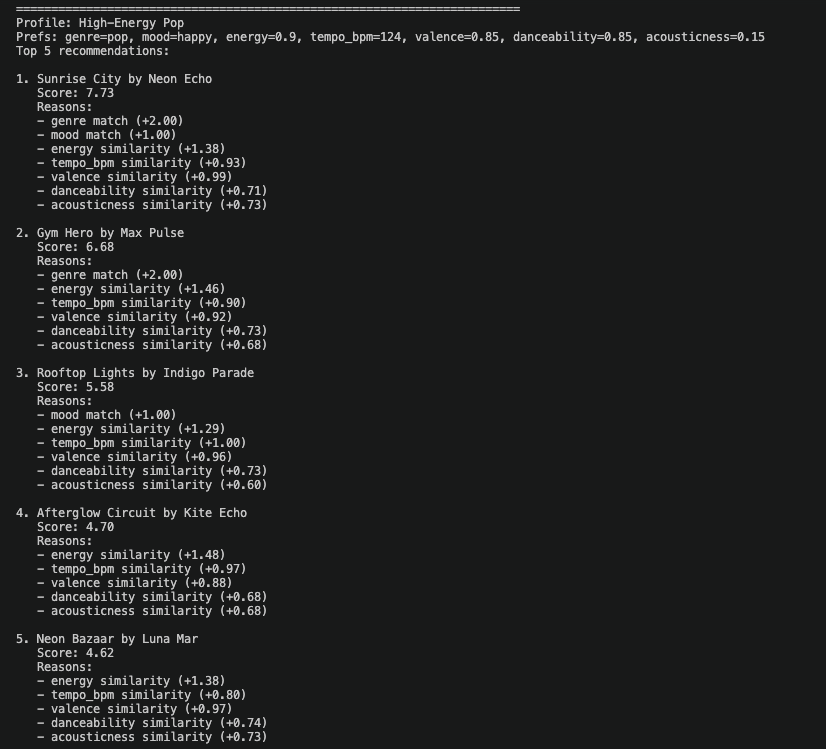
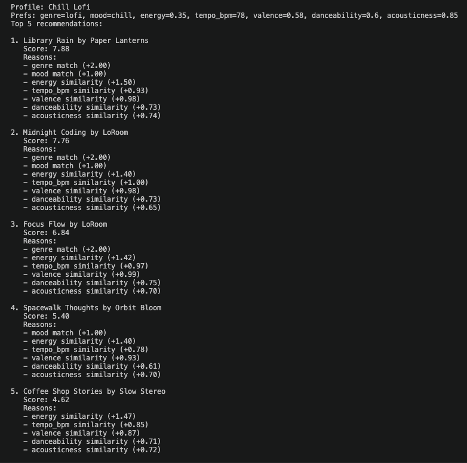
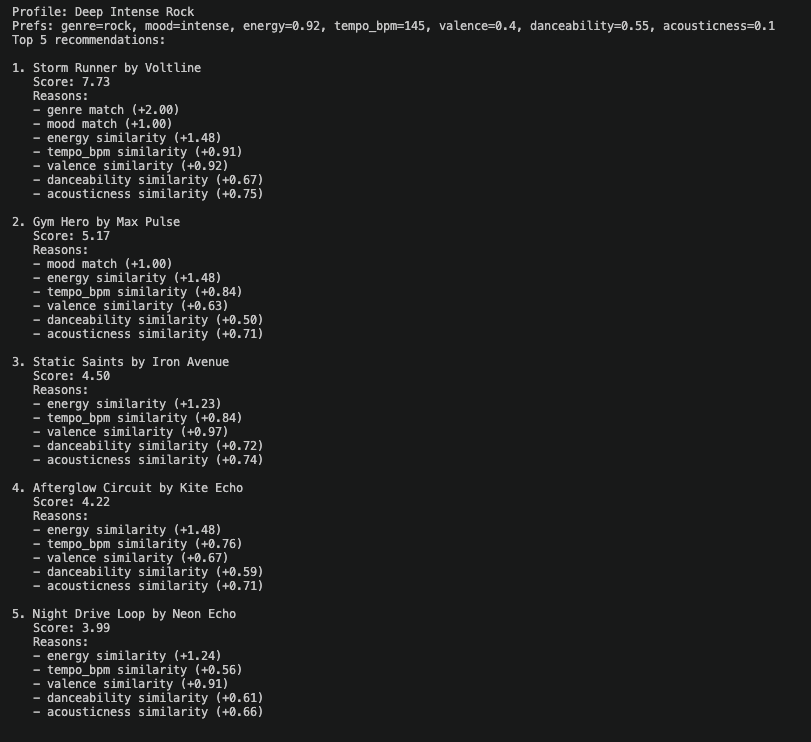
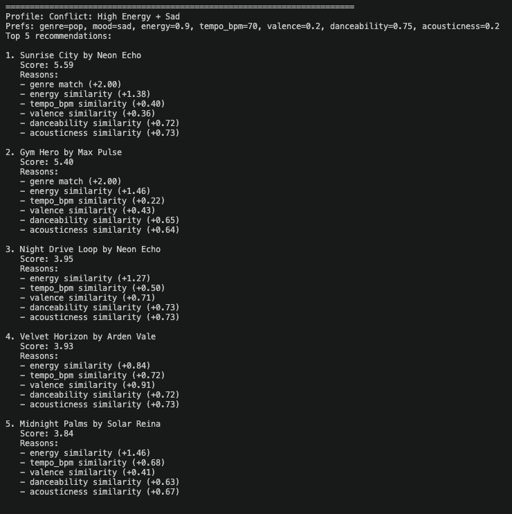
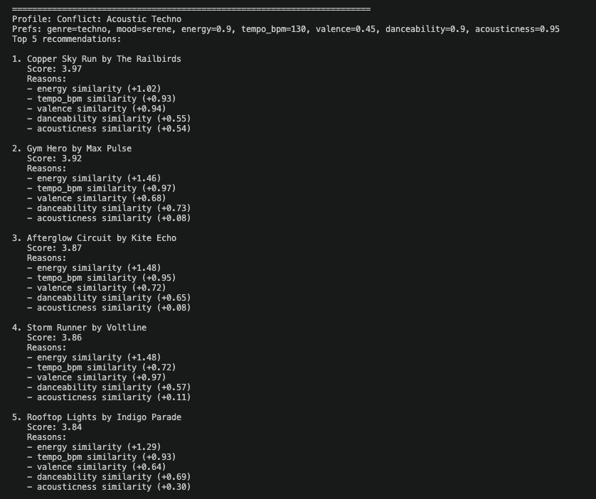

# 🎵 Music Recommender Simulation

## Project Summary

In this project you will build and explain a small music recommender system.

Your goal is to:

- Represent songs and a user "taste profile" as data
- Design a scoring rule that turns that data into recommendations
- Evaluate what your system gets right and wrong
- Reflect on how this mirrors real world AI recommenders

Replace this paragraph with your own summary of what your version does.

---

## How The System Works

This music recommender uses a **content-based filtering** approach. Instead of learning from many users, it compares each song's features to one user's taste profile and gives that song a score. The songs with the highest scores become the recommendations.

Each song in `songs.csv` stores descriptive features that capture its overall vibe: `genre`, `mood`, `energy`, `tempo_bpm`, `valence`, `danceability`, and `acousticness`. The `UserProfile` stores matching target preferences, such as a favorite genre, favorite mood, and ideal values for those numeric features. For example, a user who likes focused lofi music might prefer lower energy, slower tempo, and higher acousticness.

### Algorithm Recipe

For every song in the CSV:

1. Start the song's score at `0`.
2. Add **2.0 points** if the song's genre matches the user's favorite genre.
3. Add **1.0 point** if the song's mood matches the user's favorite mood.
4. Add similarity points based on how close the song is to the user's target values:
   - `energy`: up to **1.5** points
   - `tempo_bpm`: up to **1.0** point
   - `valence`: up to **1.0** point
   - `danceability`: up to **0.75** point
   - `acousticness`: up to **0.75** point
5. Save the final score for that song.
6. Repeat for every song in the dataset.
7. Rank all songs from highest score to lowest score.
8. Recommend the top results.

This design makes the scoring easy to explain: exact category matches matter, but songs can still earn points when their audio features are close to the user's ideal profile.

### Potential Biases

This system might **over-prioritize genre**, which could cause it to ignore songs from other genres that still match the user's mood or audio preferences well. It is also limited by the small dataset, so genres or moods with fewer examples may be recommended less often even if they would fit the user's taste.

---

## Getting Started

### Setup

1. Create a virtual environment (optional but recommended):

   ```bash
   python -m venv .venv
   source .venv/bin/activate      # Mac or Linux
   .venv\Scripts\activate         # Windows

2. Install dependencies

```bash
pip install -r requirements.txt
```

3. Run the app:

```bash
python -m src.main
```

### Running Tests

Run the starter tests with:

```bash
pytest
```

You can add more tests in `tests/test_recommender.py`.

---

## Experiments You Tried

Use this section to document the experiments you ran. For example:

- What happened when you changed the weight on genre from 2.0 to 0.5
- What happened when you added tempo or valence to the score
- How did your system behave for different types of users

## CLI Verification

I ran the command below to verify the recommender output in the terminal:

```bash
python -m src.main
```

For the default profile (`genre=pop`, `mood=happy`, `energy=0.8`), the top results matched expectations. Songs like `Sunrise City` ranked at the top because they matched both the preferred genre and mood and were also close on energy.

Add your terminal screenshot here after running the program:


## Stress Test with Diverse Profiles

I ran a stress-test pass in `src/main.py` using distinct profiles and edge cases:

- High-Energy Pop
- Chill Lofi
- Deep Intense Rock
- Conflict: High Energy + Sad
- Conflict: Acoustic Techno

I used this Copilot prompt in a separate System Evaluation chat with `#codebase` context:

```text
Given my current scoring logic and song catalog, suggest 5 adversarial user profiles that could expose weak spots or unexpected ranking behavior.
Include conflicting preferences (for example, high energy with low valence mood), out-of-distribution genre/mood pairs, and edge numeric values.
Return each profile as a Python dictionary with keys: genre, mood, energy, tempo_bpm, valence, danceability, acousticness.
```

I then ran:

```bash
python -m src.main
```

Screenshots of terminal output for each profile:







## Accuracy and Surprises

I compared the results to my own musical intuition for the **Chill Lofi** profile.

1. The top results felt right: `Library Rain`, `Midnight Coding`, and `Focus Flow` were near the top, which matches the expected low-energy, chill, and acoustic-leaning vibe.
2. A surprise showed up in the **Conflict: Acoustic Techno** profile: `Copper Sky Run` (alt-country) ranked first even though the requested genre was techno.
3. This makes sense with the current scoring formula in `recommender.py`: genre is worth +2.0 only on exact match, but strong numeric similarity across several features can still outweigh genre mismatch when no exact techno song is available.
4. I also noticed overlap in top songs across high-energy profiles (for example, `Sunrise City` appears near the top repeatedly), which suggests either the dataset is still small or the current weights favor a narrow set of high-scoring tracks.

Inline Chat prompt I used for explanation:

```text
Using my current scoring weights in src/recommender.py, explain why "Copper Sky Run" ranked #1 for the profile "Conflict: Acoustic Techno" in src/main.py.
Break down the score contribution from genre, mood, energy, tempo_bpm, valence, danceability, and acousticness.
Then suggest one small weight change that would make genre mismatches less likely to rank first.
```

## Small Data Experiment (Sensitivity Test)

I ran a **Weight Shift** experiment in `src/recommender.py`:

1. Halved genre importance from `+2.0` to `+1.0`.
2. Doubled energy importance from `1.5` to `3.0`.

Agent Mode prompt I used:

```text
Apply a scoring sensitivity experiment in src/recommender.py.
- Change genre match bonus from +2.0 to +1.0.
- Change energy similarity weight from 1.5 to 3.0.
Keep all other weights unchanged.
Verify the math is still valid (no negative similarity points, score remains additive, reasons still match computed values).
Then run python -m src.main and summarize how top-5 rankings changed for each profile.
```

What changed after running `python -m src.main`:

1. Scores increased for tracks near the target energy, even without genre matches.
2. In the adversarial **Conflict: Acoustic Techno** profile, the top result changed from `Copper Sky Run` to `Gym Hero`, showing the system now favors high-energy alignment more strongly than genre or acoustic fit.
3. Across multiple profiles, high-energy songs appeared more often in top positions, so the change made recommendations mostly **different**, not clearly more accurate.

Conclusion:

- The experiment confirmed the recommender is sensitive to weight choices.
- Boosting energy too much can reduce diversity and over-focus rankings around energetic songs.

---

## Limitations and Risks

This recommender has a few important limits. First, it only uses a small catalog (18 songs), so many profiles end up seeing repeated results. Second, it uses simple metadata and does not understand lyrics, culture, or context, so two songs with similar numbers may still feel very different to real listeners. Third, the scoring can over-focus on one feature when weights are high, which I saw when energy was increased and songs like `Gym Hero` started appearing for very different profiles. These are useful classroom tradeoffs, but they show why real systems need larger datasets and better balance controls.

---

## Reflection

I completed the full [Model Card](model_card.md) and learned that recommenders are really ranking systems built from small scoring choices. The biggest learning moment was seeing how one weight change (energy) shifted many top results, even when user intent stayed different. That showed me how sensitive recommendation behavior is to design decisions that look small in code.

Using AI tools helped me move faster when generating test profiles, drafting explanations, and spotting edge cases. I still had to double-check by running `python -m src.main`, reading score reasons, and comparing outputs to musical intuition. I was surprised that a simple additive algorithm can still feel like a real recommender when it returns ranked songs with explanations, but I also saw how quickly bias can appear through limited data and imbalanced weights.


---
